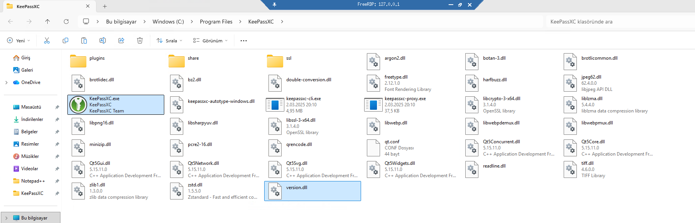
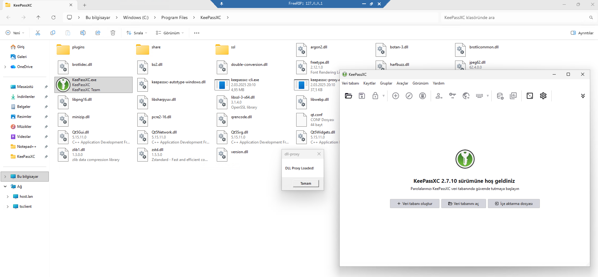

<div align="center">
  
</div>

<div align="center">
  
</div>

---

## It's This Simple

**You don't need to know anything complex to get started.** Just edit this one function in `main.cpp`:

```cpp
// Payload function - your custom code goes here
DWORD WINAPI Payload(LPVOID lpParam) {
    MessageBoxA(NULL, "DLL Proxy Loaded!", "dll-proxy", MB_OK);
    return 0;
}
```

That's it! Build, drop the DLL next to your target application, and your code runs instantly.

---

## Why This Exists

Many of the applications, tools, or whatever I used generally utilized something called winmm.dll, and after approximately 2-3 days of research, I decided to build this project to make the process as simple as possible.

The project started with pure MSVC pragma forwarding — no `.def` files, no assembly, no manual stubs. Just one `#pragma` per export. That worked great for most applications.

But some applications — particularly games built with complex engines(UE 5) — crashed immediately on launch. The PE loader's automatic resolution of pragma-level export forwarders conflicted with their aggressive multi-threaded startup and module validation. The crash happened at loader level, before our code even ran.

To fix this, I added **runtime forwarding** — `LoadLibrary` + `GetProcAddress` + MASM x64 jump thunks. Both methods now ship in the same project, selectable with a single CMake flag (`-DPROXY_METHOD=runtime`).

## Forwarding Methods

This project supports two export forwarding architectures:

### Linker Forwarding (default)

Uses MSVC-specific `#pragma comment(linker, ...)` directives to set up PE-level export forwarding. The Windows loader resolves these at load time — no runtime code needed.

```cpp
#pragma comment(linker, "/EXPORT:FuncName=\\\\.\\GLOBALROOT\\SystemRoot\\System32\\original.dll.FuncName,@1")
```

### Runtime Forwarding

Uses `LoadLibrary` + `GetProcAddress` to manually resolve the original DLL at startup, with MASM x64 jump thunks providing the actual exported functions.

```
┌─────────────┐      ┌──────────────────┐      ┌─────────────────┐
│  App.exe    │────▶│  proxy winmm.dll │────▶│ System winmm.dll│
│             │      │                  │      │  (System32)     │
│ calls       │      │ 1. LoadLibraryA  │      │                 │
│ timeGetTime │      │ 2. GetProcAddress│      │ Real functions  │
│             │      │ 3. ASM JMP thunk │      │                 │
└─────────────┘      └──────────────────┘      └─────────────────┘
```

## Supported DLLs

| DLL Name | Exports | Linker | Runtime | Common Usage |
|----------|---------|--------|---------|-------------|
| `version.dll` | 17 | ✅ | ✅ | File version info API |
| `winmm.dll` | 181 | ✅ | ✅ | Multimedia/audio — games, media players |
| `winhttp.dll` | 91 | ✅ | ✅ | HTTP client API — updaters, web apps |
| `wininet.dll` | 327 | ✅ | ✅ | Internet functions — browsers, networking |

### Find Which DLLs an Application Loads

```powershell
Get-Process -Name your_app | Select-Object -ExpandProperty Modules | Select-Object FileName
```

## Adding new DLLs

For adding new dlls look the original_dlls/README.md, its pretty easy.

## Quick Start

## Requirements

- **Compiler**: MSVC (Visual Studio 2019+)
- **Build**: CMake 3.15+
- **Target**: Windows x64 only (no 32-bit support)

### Windows (Local Build)

```bash
# Linker forwarding (default, simple)
cmake -B build -DDLL_TYPE=version
cmake --build build --config Release

# Runtime forwarding (maximum compatibility)
cmake -B build -DDLL_TYPE=winmm -DPROXY_METHOD=runtime
cmake --build build --config Release
```

Output: `build/Release/version.dll` (or `winmm.dll`, `winhttp.dll`, `wininet.dll`)

### Linux (GitHub Actions)

1. Push to GitHub
2. Go to **Actions** → **Build DLL Proxy**
3. Select DLL type and proxy method
4. Download the artifact


## Usage

### Windows

1. Build proxy DLL (e.g., `version.dll`)
2. Place in target application directory
3. Run application - payload executes on DLL load

### Linux (Wine/Proton)

1. Build proxy DLL via GitHub Actions
2. Place DLL in the game/application directory
3. Set DLL override environment variable:

```bash
# For Wine applications
WINEDLLOVERRIDES="winmm=n,b" wine your_application.exe

# For Steam games (add to launch options)
WINEDLLOVERRIDES="winmm=n,b" %command%

# Multiple DLLs
WINEDLLOVERRIDES="winmm=n,b;version=n,b" %command%
```

**Override flags:**
- `n` = native (load Windows DLL first)
- `b` = builtin (fallback to Wine's builtin implementation)

## Credits

- [Perfect DLL Proxy](https://github.com/mrexodia/perfect-dll-proxy) by mrexodia — The pragma forwarding technique and `GLOBALROOT` path approach that this project is built on.
- [UE4SS](https://github.com/UE4SS-RE/RE-UE4SS) — Unreal Engine modding framework whose runtime proxy architecture (LoadLibrary + GetProcAddress + ASM thunks) inspired our runtime forwarding method.
- [ReShade](https://github.com/crosire/reshade) — Graphics post-processing injector that uses the same DLL proxy + runtime forwarding pattern, confirming this as the industry-standard approach.

## Disclaimer

This software is provided "as is" under the MIT License. As stated in the MIT License, we accept no responsibility or liability for any use or misuse of this tool.

## License

MIT - See LICENSE file
